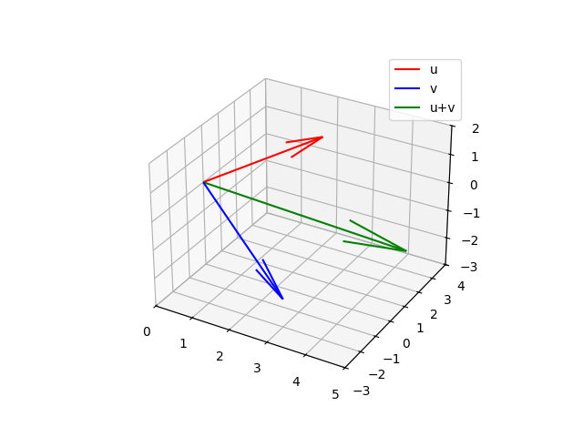

# Práctica 1: Vectores en 3 Dimensiones

**Procedimiento (Fórmulas y operaciones):**
Sean los vectores $\vec{u} = (2, 3, 1)$ y $\vec{v} = (3, -2, -2)$.
1. **Suma de vectores:** $\vec{u} + \vec{v} = (2+3, 3-2, 1-2) = (5, 1, -1)$.
2. **Áreas de los triángulos:** El área del triángulo formado por los puntos finales se calculó usando la magnitud del producto cruz:
   $A = \frac{1}{2} \| (\vec{v} - \vec{u}) \times ((\vec{u}+\vec{v}) - \vec{u}) \| \approx 7.648$.
   Esta área calculada es exactamente igual al área del triángulo formado por el origen, $\vec{u}$, y $\vec{v}$, ya que representan mitades del mismo paralelogramo base.
3. **Triángulo rectángulo:** Para los puntos $A=(-1,2,1.5)$, $B=(1,2,2)$, $C=(1,7,1.5)$, las longitudes de los lados son $AB \approx 2.06$, $BC \approx 5.02$, $AC \approx 5.38$. Dado que $AB^2 + BC^2 \neq AC^2$ ($29.5 \neq 29.0$), el triángulo no es rectángulo.

**Evidencia de Simulación:**

**Conclusiones:**
Las herramientas computacionales permiten visualizar de forma clara cómo las operaciones algebraicas (como la suma de vectores) se representan geométricamente como traslaciones en el espacio tridimensional. El cálculo del área de los triángulos demostró las propiedades conservativas de los paralelogramos que se forman con la suma vectorial.
