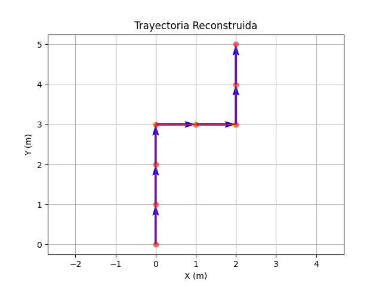

# Práctica 2: GPS para Vectores de Desplazamiento

**Procedimiento (Fórmulas y operaciones):**
1. Se utilizaron datos de coordenadas de un recorrido para el ejemplo.
2. **Cálculo de Desplazamientos:** $v_{xi} = x_i - x_{i-1}$, $v_{yi} = y_i - y_{i-1}$.
   Se identificaron tramos de movimiento a lo largo del eje Y (0,1) y luego a lo largo del eje X (1,0).
3. **Magnitud de cada tramo:** $\|v\| = \sqrt{v_x^2 + v_y^2}$. La distancia total calculada mediante los vectores $d = \sum \|v_i\| = 7.0$ unidades.
4. **Ángulo entre tramos:** Para un tramo $v_1 = (0,1)$ y otro subsecuente $v_2 = (1,0)$, el ángulo de giro se encontró con el producto punto: $\theta = \arccos\left(\frac{v_1 \cdot v_2}{\|v_1\|\|v_2\|}\right) = 90^\circ$.

**Evidencia de Simulación:**

**Conclusiones:**
El modelado de un recorrido mediante vectores permite descomponer el movimiento continuo en tramos analizables. Operaciones matemáticas puras como el producto punto resultan de gran utilidad para determinar trayectorias, ángulos de giro y distancias, evidenciando una aplicación directa del álgebra lineal en la navegación moderna (GPS).
