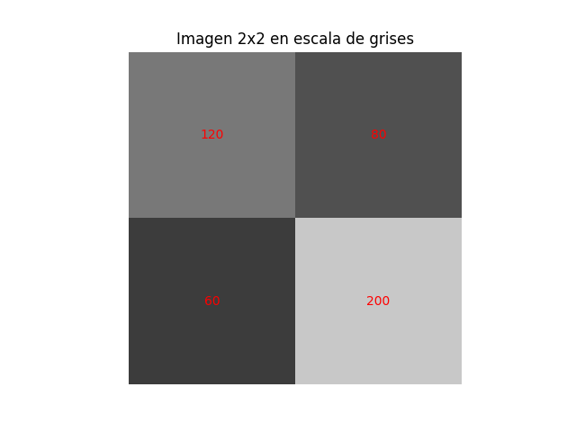

# Práctica 3: Ejemplos de Espacios Vectoriales de Dimensión Finita e Infinita

**Procedimiento (Fórmulas y operaciones computacionales):**
Análisis y clasificación de diversos conjuntos para determinar su estructura de espacio vectorial:
*   $\mathbb{R}^2$: Finito. Base $\{(1,0), (0,1)\}$, Dimensión 2.
*   $P_2$ (Polinomios de grado $\le 2$): Finito. Base $\{1, x, x^2\}$, Dimensión 3.
*   $M_{2\times2}$ (Matrices $2\times2$): Finito. Base $\{E_{11}, E_{12}, E_{21}, E_{22}\}$, Dimensión 4.
*   $\mathbb{P}$ (Todos los polinomios): Infinito. Posee el conjunto linealmente independiente $\{1, x, x^2, x^3, \dots\}$.

**Ejecución de Código:**
Mediante `p3_script.py` se validaron los siguientes ejercicios propuestos:
1.  **Color RGB:** El color $c=(120, 200, 75)$ se puede calcular resolviendo el sistema para proyectarlo en los vectores base de $\mathbb{R}^3$, confirmando ser una combinación lineal directa.
2.  **Imágenes como Matrices:** Se comprobó que una imagen $A=\begin{bmatrix}120 & 80 \\ 60 & 200\end{bmatrix}$ es la combinación lineal $120E_{11} + 80E_{12} + 60E_{21} + 200E_{22}$.
3.  **Polinomios:** Usando un sistema simbólico, los polinomios $p(x) = 1 + 2x - x^2$ y $q(x) = 3 - x + 4x^2$ se sumaron obteniendo $3x^2 + x + 4$. Sus coordenadas respectivas en la base $\{1, x, x^2\}$ se extrajeron programáticamente como $[1, 2, -1]$ y $[3, -1, 4]$.

**Evidencia de Simulación:**

**Conclusiones:**
Comprender la diferencia entre dimensión finita e infinita es fundamental. Mientras que un píxel de color o una pequeña matriz gráfica puede representarse computacionalmente mediante una base finita (como arreglos en numpy), modelos infinitos requieren una abstracción matemática superior. Además, programar estos modelos confirma cómo las propiedades teóricas de combinación lineal e independencia lineal se traducen directamente a operaciones matriciales de álgebra computacional en un sistema digital.
