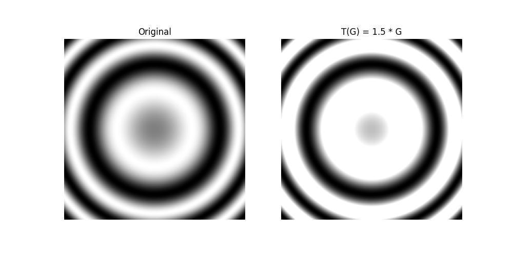
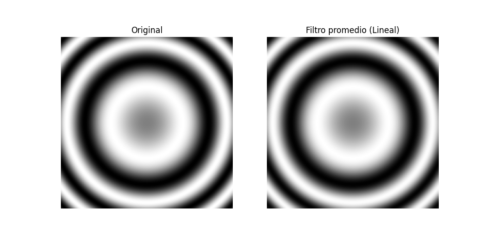
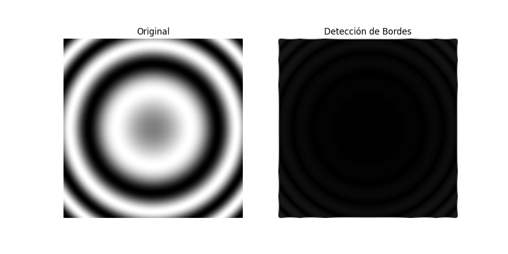

# Práctica 4: Transformaciones Lineales Aplicadas a una Imagen

**Procedimiento (Fórmulas y operaciones):**
1. La imagen (generada matemáticamente) se modeló como una matriz de espacio bidimensional $G$ con valores escalados a $[0,1]$.
2. **Contraste Lineal:** Transformación lineal punto a punto $T(G) = 1.5 \cdot G$. Los valores que superan 1 se limitaron (clipping).
3. **Filtro Promedio (Desenfoque):** Transformación usando convolución discreta. Se usó un kernel/matriz base $K = \frac{1}{25}\text{ones}(5,5)$.
4. **Detección de Bordes:** Transformación que calcula segundas derivadas espaciales usando una convolución con un kernel Laplaciano.

**Evidencia de Simulación:**

**Conclusiones:**
Las imágenes digitales se comportan algebraicamente como matrices. Aplicar filtros o ajustes visuales, matemáticamente, no es más que someter este espacio a transformaciones lineales y multiplicaciones por escalares/matrices de paso. Esto demuestra de manera práctica que el núcleo del procesamiento moderno de imágenes está sustentado enteramente por el álgebra lineal.
