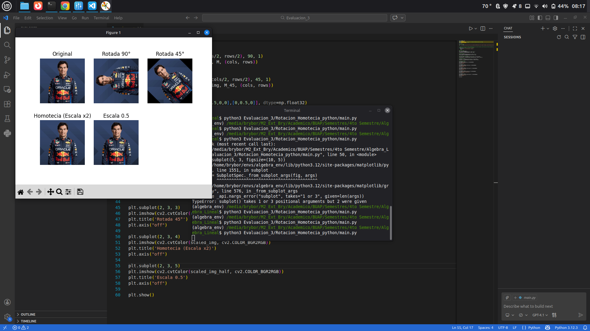

###### Este programa de python realiza las siguiente operaciones:

- Rotación de 90°
  - ```python
    rows, cols = img.shape[:2]
    M = cv2.getRotationMatrix2D((cols/2, rows/2), 90, 1)
    rotated_img = cv2.warpAffine(img, M, (cols, rows))
    ```
- Rotacion de 45°
  - ```python
    M_45 = cv2.getRotationMatrix2D((cols/2, rows/2), 45, 1)
    rotated_img_45 = cv2.warpAffine(img, M_45, (cols, rows))
    ```
- Escalado de 2x
  - ```python-repl
    scale_matrix = np.array([[2,0,0],[0,2,0]], dtype=np.float32)
    scaled_img = cv2.warpAffine(img, scale_matrix, (cols*2, rows*2))
    ```
- Escalado de 0.5
  - ```python
    scale_matrix_half = np.array([[0.5,0,0],[0,0.5,0]], dtype=np.float32)
    scaled_img_half = cv2.warpAffine(img, scale_matrix_half, (cols//2, rows//2))
    ```

###### Evidencia:



###### Actividad de clase

- Alumno: Bryan A. Borges
- Curso: Algebra Lineal
- M.C: Margarita Carmina García Lopéz
- BENEMERITA UNIVERSIDAD AUTONOMA DE PUEBLA (BUAP)
- Lic: Ing. CIencias de la Computación
