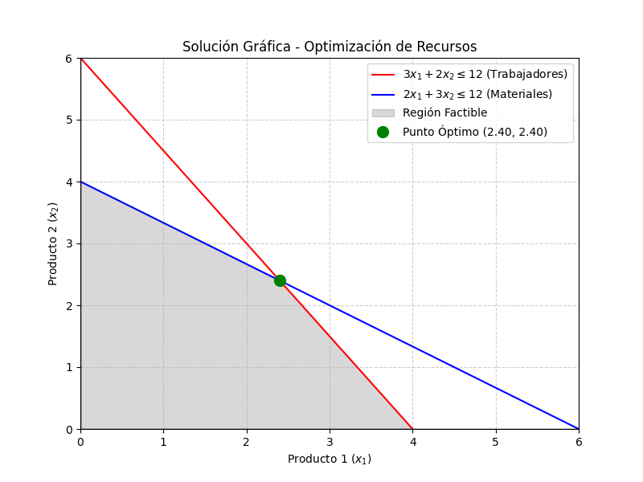

# Práctica: Resolución de Problemas de Optimización con el Método Simplex

Este repositorio contiene la resolución del problema de optimización de asignación de recursos utilizando el Método Simplex en Python.

## 1. El Problema Planteado
En una empresa de producción, se busca maximizar la ganancia obtenida al fabricar dos productos sujetos a restricciones de recursos (trabajadores y materiales).

**Función Objetivo:**
Maximizar $Z = 4x_1 + 5x_2$

**Sujeto a las restricciones:**
- Trabajadores: $3x_1 + 2x_2 \leq 12$
- Materiales: $2x_1 + 3x_2 \leq 12$
- No negatividad: $x_1 \geq 0$, $x_2 \geq 0$

## 2. Proceso de Resolución
Para resolver este problema, utilizamos Python y la librería `scipy.optimize`, en particular la función `linprog()`.

1. **Definición de Variables:** Se tradujeron las inecuaciones al modelo matricial esperado por la función. Dado que `linprog` minimiza por defecto, multiplicamos la función objetivo por `-1` ($Z' = -4x_1 - 5x_2$) para transformarla en un problema de minimización.
2. **Planteamiento de Matrices:** Se declararon la matriz de coeficientes $A$ y el vector de recursos $b$.
3. **Ejecución Simplex:** Se mandó a ejecutar el método a través del argumento `method='highs'` (una evolución eficiente de Simplex utilizada internamente por SciPy).
4. **Visualización Gráfica:** Se graficaron las funciones de restricción mediante `matplotlib` para identificar visualmente la región factible y el vértice que conforma el punto óptimo.

## 3. Resultados Obtenidos
Tras ejecutar el código, el algoritmo alcanzó con éxito el punto óptimo:

- **Cantidad óptima de Producto 1 ($x_1$):** 2.40 unidades
- **Cantidad óptima de Producto 2 ($x_2$):** 2.40 unidades
- **Ganancia Máxima Total ($Z$):** 21.60 unidades monetarias.

Se verificó que en este punto óptimo, **ambos recursos** (trabajadores y materiales) son aprovechados al 100% de su capacidad (12 de 12 recursos utilizados en cada caso). 
Se generó el gráfico `Resultados_Graficos_Simplex.png` donde se observa el punto de cruce exacto de las restricciones (el vértice superior derecho de la región factible).

## 4. Aplicación del Método Simplex en el Ámbito Empresarial
El método Simplex es una de las herramientas matemáticas más potentes y utilizadas en el ámbito corporativo y en la **Investigación de Operaciones**. Su naturaleza escalable permite aplicarlo a problemas con cientos o miles de variables y restricciones. Algunos ejemplos de aplicación empresarial incluyen:

1. **Logística y Transporte:** Optimización de rutas de entrega o cadenas de suministro para minimizar costos de transporte, peajes o tiempos de entrega, cumpliendo con la demanda de los clientes en distintas localizaciones.
2. **Finanzas y Portafolios de Inversión:** Asignación de capital en diversas opciones de inversión con el objetivo de maximizar el retorno esperado o minimizar el riesgo general del portafolio, respetando los límites de liquidez y presupuesto.
3. **Planificación de la Producción:** Definir cuántos turnos de trabajo programar o cuánta materia prima comprar considerando la capacidad de almacenamiento, el flujo de maquinaria y las metas de ventas mensuales (mezcla óptima de producción).
4. **Recursos Humanos:** Asignación de personal en horarios variables, de tal manera que se minimice el costo de nómina mientras se garantiza un número mínimo de empleados requerido por turno.

En todos estos casos, el objetivo es el mismo: encontrar matemáticamente la **mejor decisión posible** frente a la escasez, transformando un problema de la vida real en un modelo lineal altamente eficiente.

## Capturas y resultado

  
  

