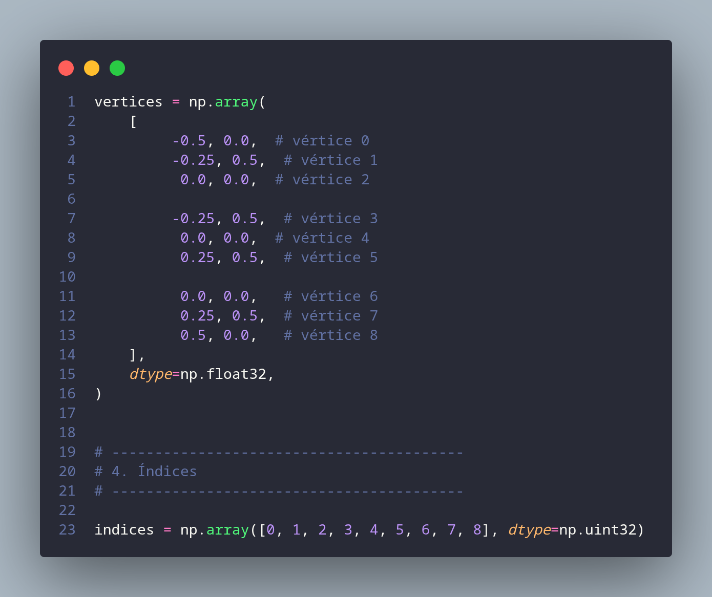
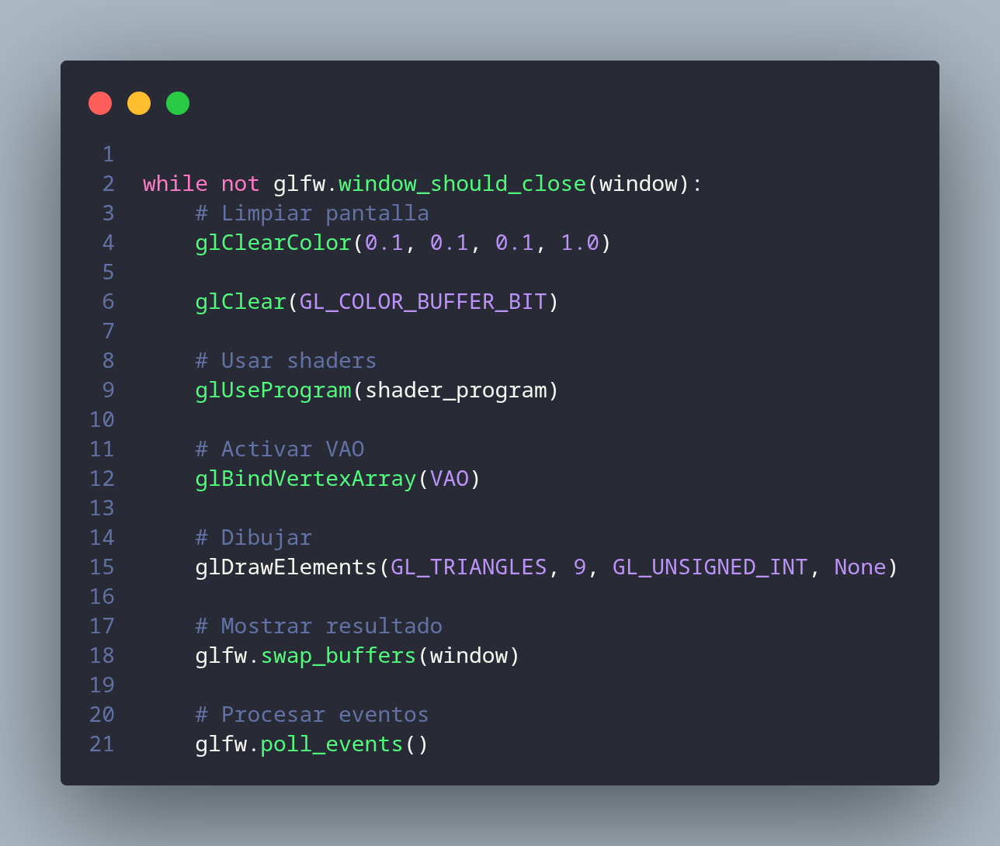
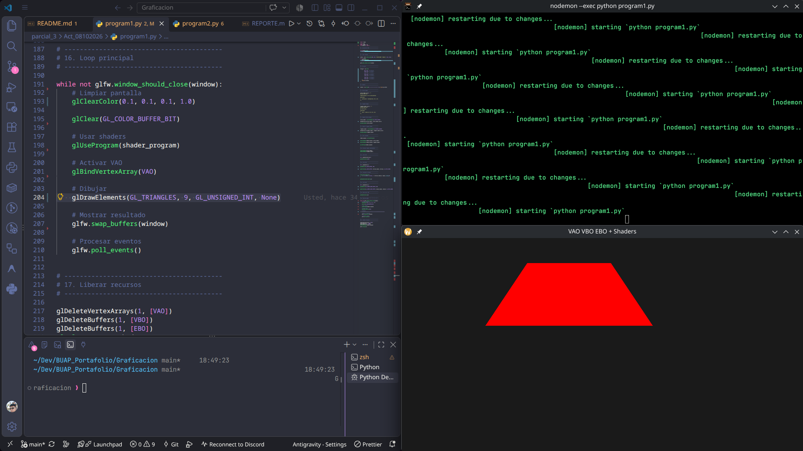
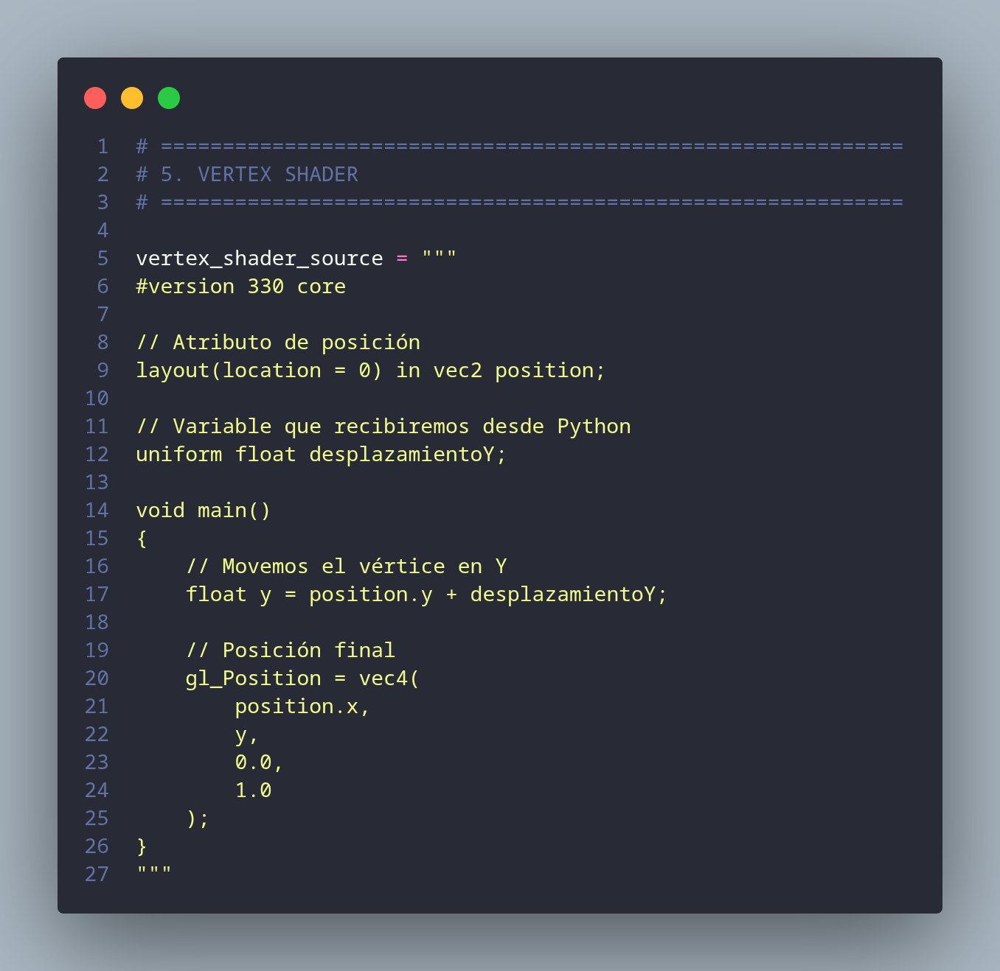
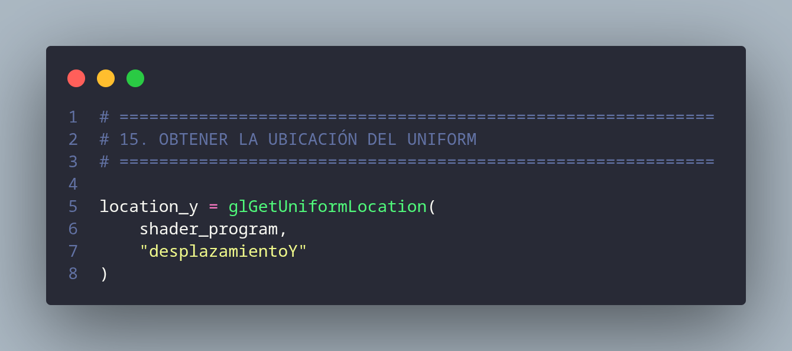
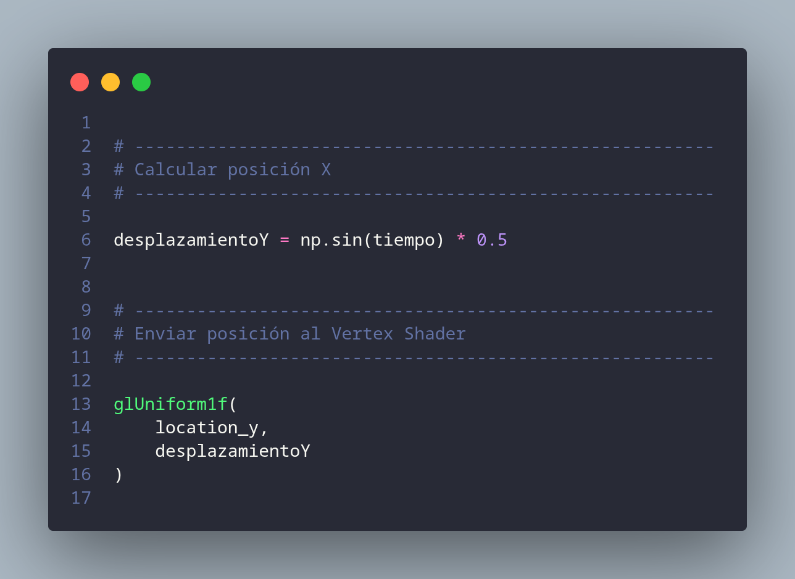

# Ejercicio 1

## Modificar el codigo de manera que se forme un trapecio usando 3 triangulos.

Evidencia de modificaciones.

Eh agregado mis vertices iniciando del eje negativo en x para que de esta manera el triangulo que se forma al centro su vertice inferios quede en 0,0 para que quede centrada la figura.

Aqui en modificado solo el numero de vertices que se dibujan a 9 que es la cantidad que meneja mi arreglo.

Evidencia de ejecución.

# Ejercicio 2.

## Modificar el codifo para que la figura se mueva de arriba - abajo.

Evidencia de modificaciones.

Aqui eh solo modificado el nombre de las variables y en cambiado que la posicion en el eje x sea fija y que y varie de manera que en la posicion final solo se invierte el codigo.

De igual manera solo cambie el nombre de las variables en las siguientes 2 capturas.

Evidencia de funcionamiento.

<video width="640" controls>
  <source src="./image/REPORTE/1791510008254.mp4" type="video/mp4">
  Tu navegador no soporta la reproducción de video.
</video>

[Enlace al repositorio de GitHub para ver el video.](https://github.com/Bryborj/BUAP_Portafolio/blob/main/Graficacion/parcial_3/Act_08102026/image/REPORTE/1791510008254.mp4)
