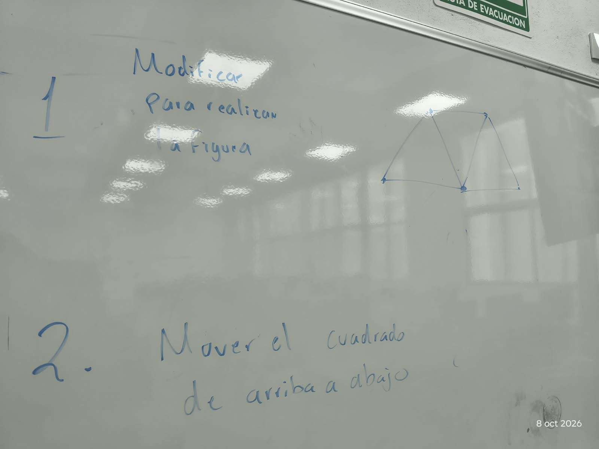

# Actividades y tareas (PARCIAL 3)

## 8/10/2026

### Realizar modificaciones a los programas realizados en clase.

1. P1. Realizar una modificacion a la figura.
2. P2. Mover figura de arriba a abajo

Nota: Imagen de referencia.

Entregable:

- Presentar los programas de manera presencial con las modificaciones
- Teams: Reporte con portada, con capturas de pantalla de las modificaciones del codigo y de los resultados.

Entregable: [REPORTE](Act_08102026/REPORTE.md)
