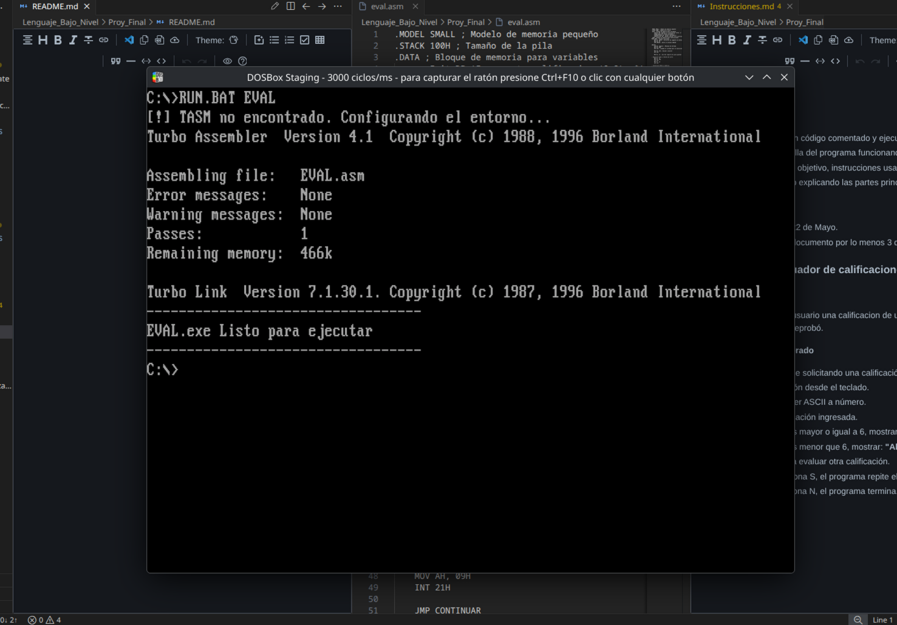
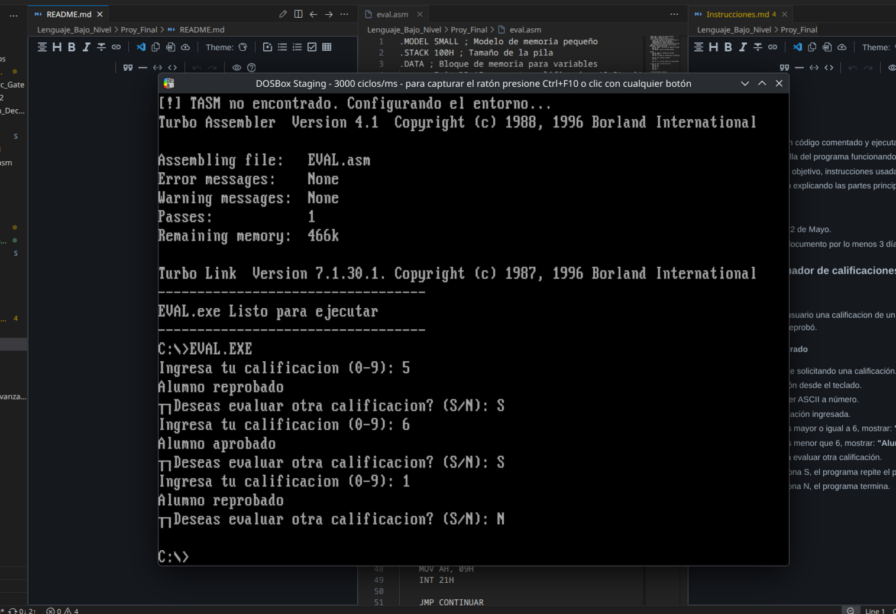

#### Evaluador de calificaciones

**Objetivo del proyecto:**

   Realizar integracion de los conceptos vistos en la clase de **Lenguaje de Bajo NIvel** para desarrollar un programa en ensamblador que pida al usuario ingresar una calificación de un digito, es decir del 0 al 9 y mostrar si es que el alumno aprobo o reprobó.

**Instrucciones usadas en el programa:**

```asm
.MODEL SMALL
.STACK 100H
```

Definicion del modelo de memoria y reserva de espacio para la pila.

```asm
.DATA ; Bloque de memoria para variables
    msgInit DB 'Ingresa tu calificacion (0-9): $'
    msgAprobado DB 'Alumno aprobado $'
    msgNoAprobado DB 'Alumno reprobado $'
    msgContinuar DB '¿Deseas evaluar otra calificacion? (S/N): $'
```

Con `.DATA` declaro el inicio de la sección donde declaro variables en este caso los mensajes, `DB` Por sus siglas Define Byte  reserva byte por cada letra de la cadena en la variable.

`.CODE` Define el inicio del bloque de memoria para las instrucciones del procesador, `MOV AX, @DATA` y `MOV DS,AX` siendo la primera para iniciar el segmento de datos `DS` usando `AX` como un puente de datos.

`LEA` obtiene la dirección de memoria donde esta la variable segido de `AH, 09H` para imprimir la cadena de texto obtenida desde el puntero de `LEA DX, msgInit`.

`INT 21H` Siendo la interrupcion obligatoria para llevar a cabo cualquier proceso que se requiera del sistema el cual es dado a travez de `MOV AH, (Valor)`.

`SUB BL, 30H` Aqui llevo a cabo la conversión de ASCII a numerico, ya que el valor obtenido si no lo convierto , suponiendo que e usuario ingresa "5" la entrada se refleja como 35H que es el valor hexadecimal por lo tanto se le resta 30H al registro. 

```asm
    CMP BL, 6 ; Comparacion de la entrada
    JG APROBADO ; Si es mayor
    JE APROBADO ; Si es igual
    JL NO_APROBADO ; Si es menor
```

`CMP` Realiza la comparacion del registro con un valor en concreto.

`JG` Si el registro es mayor realiza un salto a la funcion APROBADO

`JE` Si el registro es igual realiza igual un salfo a la funcion APROBADO

`JL` Realiza el salto si el registro es menor a 6 a la funcion NO_APROBADO

```asm
APROBADO:
    LEA DX, msgAprobado
    MOV AH, 09H
    INT 21H

    JMP CONTINUAR ; Salto al proceso CONTINUAR
```

`JMP` 	Realiza un salto a una seccion en concreto sin requerir de `CMP`.


**Evidencia de ejecución:**




---

**Datos:**

- Alumno: Bryan Albino Borges
- Matricula: 202423701
- Institucion: BUAP
- Curso: Lenguaje de Bajo Nivel.
- Docente: Luis Gustavo Olivares Soto.
